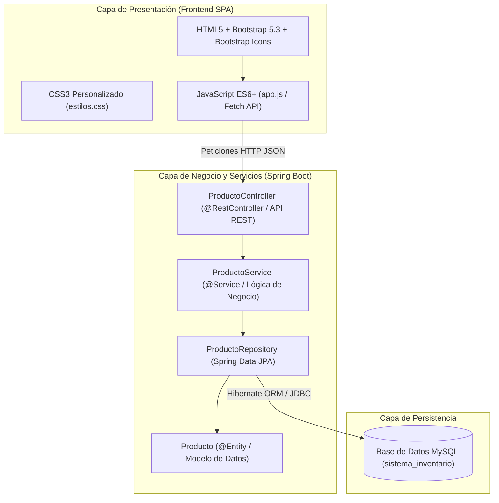

# 📚 DOCUMENTACIÓN TÉCNICA Y DE USUARIO
# SISTEMA DE GESTIÓN DE INVENTARIOS SENA

---

## 1. INFORMACIÓN INSTITUCIONAL Y DEL PROYECTO

* **Nombre del Proyecto:** Sistema de Gestión y Control de Inventarios
* **Programa de Formación:** Tecnólogo en Análisis y Desarrollo de Software (ADSO)
* **Número de Ficha:** 3233929
* **Aprendiz:** Deily Tatiana Suarez Rodriguez
* **Institución:** Servicio Nacional de Aprendizaje (SENA)
* **Año:** 2026

---

## 2. INTRODUCCIÓN Y OBJETIVOS

### 2.1 Descripción del Proyecto
El **Sistema de Gestión de Inventarios** es una solución web empresarial desarrollada bajo una arquitectura cliente-servidor por capas. Su propósito principal es sistematizar el registro, control de existencias, valuación de stock y administración de proveedores de una empresa o almacén, permitiendo la persistencia permanente y en tiempo real de los datos a través de una base de datos relacional MySQL.

### 2.2 Objetivos
* **Objetivo General:** Desarrollar un aplicativo web interactivo y responsivo conectado a una API REST para administrar de forma íntegra las existencias de productos.
* **Objetivos Específicos:**
  1. Diseñar una interfaz de usuario limpia, accesible y responsiva utilizando HTML5, CSS3 y Bootstrap 5.
  2. Implementar una navegación fluida tipo SPA (*Single Page Application*) que permita operar el sistema desde una sola pantalla sin recargas de página.
  3. Construir una API REST robusta en el backend utilizando Java 17 y Spring Boot 3.
  4. Gestionar el mapeo objeto-relacional (ORM) y la persistencia de datos en MySQL mediante Spring Data JPA y Hibernate.
  5. Asegurar las operaciones fundamentales de datos: Crear, Leer, Actualizar y Eliminar (CRUD).

---

## 3. ARQUITECTURA DEL SISTEMA Y TECNOLOGÍAS

El proyecto implementa una **Arquitectura en Capas** desacoplada:



### 3.1 Tecnologías del Frontend
* **HTML5 Semántico:** Estructuración de contenido mediante etiquetas semánticas (`header`, `nav`, `main`, `section`, `footer`).
* **Bootstrap 5.3.3:** Framework CSS utilizado para grillas responsivas (`row`, `col-md-6`), tipografías, componentes de tarjetas (`card`), tablas dinámicas y botones de acción.
* **Bootstrap Icons 1.11.3:** Librería de iconografía vectorial para mejorar la usabilidad visual de formularios, estadísticas y menús.
* **CSS3 Personalizado (`estilos.css`):** Paleta corporativa en tonos azul profesional (`#1a5276`, `#154360`) y verde esmeralda (`#27ae60`), animaciones suaves (`fadeIn`) y estilos para la navegación SPA.
* **JavaScript Moderno (`app.js`):** Manejo del DOM, peticiones asíncronas mediante `fetch()`, promesas (`async/await`), validaciones de formularios y renderizado reactivo de datos.

### 3.2 Tecnologías del Backend
* **Java 17+:** Lenguaje de programación fuertemente tipado y orientado a objetos.
* **Spring Boot 3.3.3:** Framework para simplificar el desarrollo de aplicaciones empresariales autónomas.
  * **Spring Web:** Soporte para la construcción de controladores REST y despacho de peticiones HTTP.
  * **Spring Data JPA:** Abstracción sobre Hibernate para la ejecución automática de operaciones SQL sin sentencias manuales.
  * **Tomcat Embebido:** Servidor web integrado configurado en el puerto **8081**.
* **MySQL Connector/J:** Driver JDBC para establecer la comunicación directa con el motor de base de datos MySQL.
* **Apache Maven:** Herramienta para la gestión del ciclo de vida del software, compilación y dependencias (`pom.xml`).

---

## 4. MODELO Y DICCIONARIO DE DATOS

### 4.1 Entidad `Producto`
* **Tabla física en MySQL:** `producto`
* **Estrategia de clave primaria:** Autoincremental (`GenerationType.IDENTITY`).

| Campo | Tipo Java | Tipo SQL | Restricciones | Descripción |
|---|---|---|---|---|
| `id` | `Long` | `BIGINT` | `PRIMARY KEY`, `AUTO_INCREMENT` | Identificador único del producto en el sistema. |
| `codigo` | `String` | `VARCHAR(255)` | `NOT NULL` | Código alfanumérico visible para inventario (ej. P001). |
| `nombre` | `String` | `VARCHAR(255)` | `NOT NULL` | Nombre comercial o descriptivo del artículo. |
| `categoria` | `String` | `VARCHAR(255)` | `NOT NULL` | Clasificación (Tecnología, Papelería, Accesorios, Otros). |
| `precio` | `Double` | `DOUBLE` | `NOT NULL`, `>= 0` | Precio unitario de venta en pesos colombianos ($ COP). |
| `cantidad` | `Integer` | `INT` | `NOT NULL`, `>= 0` | Número de unidades físicas disponibles en bodega. |
| `proveedor` | `String` | `VARCHAR(255)` | `NOT NULL` | Razón social o nombre de la empresa proveedora. |

---

## 5. ESPECIFICACIÓN DE LA API REST (ENDPOINTS CRUD)

La API expone los servicios bajo la ruta base: `/api/productos` (soporta también `/productos`):

| Método HTTP | Endpoint | Descripción | Cuerpo de Petición (Request Body) | Código Respuesta |
|---|---|---|---|---|
| **GET** | `/api/productos` | Obtiene el listado completo de productos registrados. | Ninguno | `200 OK` (Array JSON) |
| **GET** | `/api/productos/{id}` | Busca un producto específico por su ID primario. | Ninguno | `200 OK` / `404 Not Found` |
| **POST** | `/api/productos` | Registra un nuevo producto en la base de datos MySQL. | Objeto JSON con los atributos del producto | `201 Created` (Producto guardado) |
| **PUT** | `/api/productos/{id}` | Actualiza la totalidad de los datos de un producto existente. | Objeto JSON con los nuevos valores | `200 OK` / `404 Not Found` |
| **DELETE** | `/api/productos/{id}` | Elimina permanentemente un producto de la base de datos. | Ninguno | `204 No Content` |

#### Ejemplo de Objeto JSON (Payload):
```json
{
  "codigo": "P001",
  "nombre": "Teclado Mecánico RGB",
  "categoria": "Accesorios",
  "precio": 150000.0,
  "cantidad": 10,
  "proveedor": "Tecno SAS"
}
```

---

## 6. MÓDULOS DE LA INTERFAZ DE USUARIO (SPA)

El sistema funciona de forma unificada desde un único enlace principal (`http://localhost:8081`):

### 6.1 Módulo 1: Inicio / Tablero de Control (Dashboard)
* **Indicador de Conexión:** Badge superior que monitorea y valida en tiempo real la conexión con el servidor y MySQL (🟢 Conectado / 🔴 Desconectado).
* **Tarjetas Estadísticas Inteligentes:**
  1. *Total Productos:* Conteo dinámico de productos en la base de datos.
  2. *Disponibles:* Artículos con stock mayor a 0.
  3. *Agotados:* Artículos con stock en 0 que requieren compra o abastecimiento.
  4. *Valor Total:* Monto acumulado de inversión en almacén (suma de `precio * cantidad`).
* **Accesos Rápidos:** Botones interactivos que permiten saltar directamente al formulario o a la tabla sin recargar la página.
* **Presentación Institucional:** Datos del aprendiz, número de ficha y funciones principales.

### 6.2 Módulo 2: Consultar Productos (Inventario)
* **Búsqueda Dinámica en Tiempo Real:** Filtra instantáneamente por código, nombre o proveedor a medida que el usuario escribe en el campo de texto.
* **Filtro por Categoría:** Desplegable para segmentar por Tecnología, Papelería, Accesorios u Otros.
* **Tabla Interactiva:** Listado detallado con estado visual (Disponible en verde / Agotado en rojo).
* **Acciones Rápidas:**
  * Botón **Editar:** Carga inmediatamente la información en el formulario y cambia a la vista de edición.
  * Botón **Eliminar:** Ventana de confirmación y borrado inmediato en la base de datos MySQL.
* **Valuación Total:** Muestra la sumatoria económica total del inventario filtrado.

### 6.3 Módulo 3: Registrar / Actualizar Producto
* Formulario estructurado en 2 columnas con validación de campos obligatorios e iconos descriptivos.
* Doble propósito inteligente:
  * **Modo Registro:** Para dar de alta artículos nuevos con botón verde *"Guardar producto"*.
  * **Modo Edición:** Al pulsar "Editar" desde la tabla, los campos se precargan, el botón cambia a amarillo *"Actualizar producto"* y se habilita el botón *"Cancelar edición"*.
* **Alertas Dinámicas:** Mensajes flotantes informando el éxito de la operación o advertencias si falta algún dato.

---

## 7. RELACIÓN CON LA METODOLOGÍA SCRUM

El ciclo de desarrollo de este proyecto se estructuró siguiendo el marco ágil **SCRUM**:

* **Product Owner:** Instructor del SENA (establece los requerimientos formativos y de negocio).
* **Scrum Master & Developer:** Deily Tatiana Suarez Rodriguez (gestión y desarrollo del proyecto).
* **Product Backlog:** Lista de necesidades (diseño de vistas, conexión a base de datos, operaciones CRUD, validación).

### Desglose de Sprints:
1. **Sprint 1 - Maquetación y Prototipado:**
   * Creación de la estructura HTML5 semántica y diseño visual con Bootstrap 5 y estilos CSS.
2. **Sprint 2 - Modelado de Base de Datos y Persistencia:**
   * Creación del esquema `sistema_inventario` en MySQL y modelado de la entidad JPA `Producto`.
3. **Sprint 3 - Desarrollo de la Capa de Servicios y API REST:**
   * Construcción del Repositorio JPA, Servicio de Negocio y Controlador REST con endpoints CRUD.
4. **Sprint 4 - Integración Cliente-Servidor y Refactorización SPA:**
   * Integración de la lógica en JavaScript con Fetch API, soporte SPA en un solo link, resolución de conflictos de puertos y pruebas de persistencia.

---

## 8. GUÍA DE INSTALACIÓN Y PUESTA EN MARCHA

### 8.1 Requisitos Previos
* **Java Development Kit (JDK):** Versión 17 o superior instalada.
* **Motor MySQL:** Servidor MySQL activo (a través de XAMPP, Laragon o MySQL Server local en el puerto `3306`).
* **Navegador Web:** Google Chrome, Microsoft Edge o Mozilla Firefox.

### 8.2 Configuración de la Base de Datos
1. Iniciar el servicio de MySQL desde el panel de control de **XAMPP**.
2. Crear la base de datos ejecutando en la consola o en phpMyAdmin:
   ```sql
   CREATE DATABASE IF NOT EXISTS sistema_inventario;
   ```
3. Verificar las credenciales en `src/main/resources/application.properties`:
   ```properties
   spring.datasource.url=jdbc:mysql://localhost:3306/sistema_inventario?useSSL=false&serverTimezone=UTC&allowPublicKeyRetrieval=true&useUnicode=true&characterEncoding=UTF-8
   spring.datasource.username=root
   spring.datasource.password=19Sep2002
   server.port=8081
   ```

### 8.3 Compilación y Ejecución
1. Abrir la terminal (**PowerShell** o **CMD**) en la carpeta raíz del proyecto:
   ```powershell
   cd "c:\Users\ASUS\Downloads\sistema-inventario deily\sistema-inventario"
   ```
2. Compilar el código fuente con Maven:
   ```powershell
   .\mvnw.cmd clean compile
   ```
3. Iniciar la aplicación Spring Boot:
   ```powershell
   .\mvnw.cmd spring-boot:run
   ```
4. Esperar el mensaje de confirmación en la consola:
   ```text
   Started SistemaInventarioApplication in X seconds (process running for X)
   Tomcat started on port 8081 (http)
   ```

### 8.4 Acceso al Sistema
Abra **Google Chrome** y navegue a la siguiente dirección:
👉 **`http://localhost:8081`**
